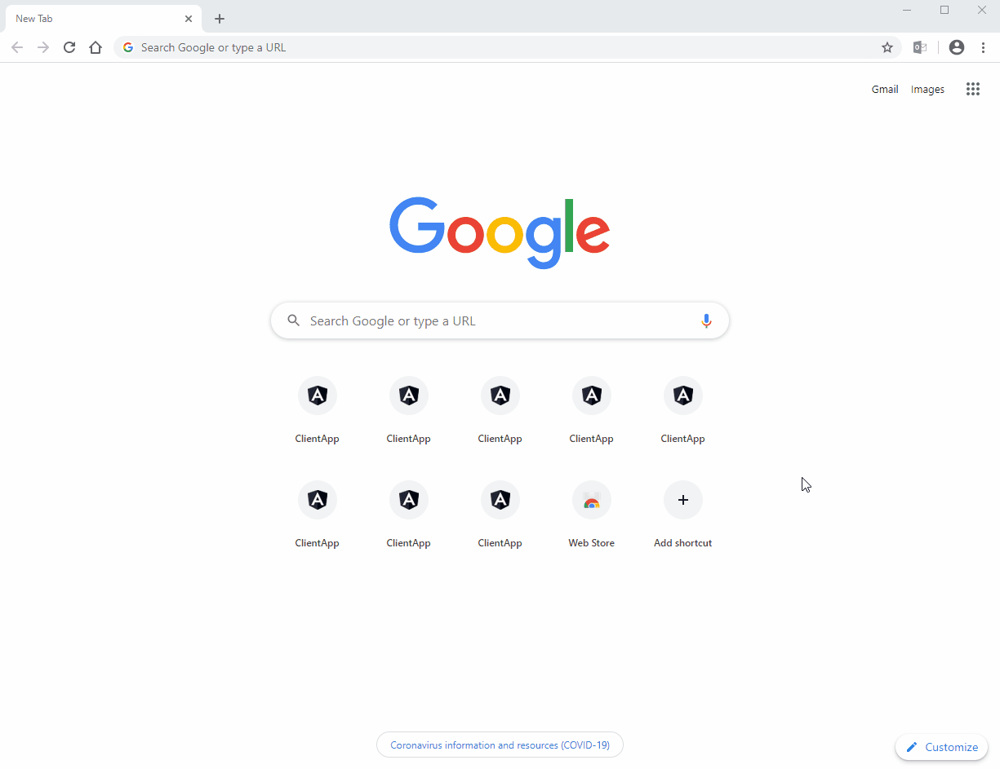

# Products-API-AngularCLI
Simple project to show all avaliable products. Uses .Net core as API dev environment and Angular CLI as front end



## Prerequisites

* [.NET Core 3.1 SDK](https://dotnet.microsoft.com/download)

* [Visual Studio 2019](https://visualstudio.microsoft.com/vs/)

For the Angular front-end I have used:

* [VS Code](https://code.visualstudio.com/)

* [Node.js](https://nodejs.org/en/)

* [Angular CLI](https://cli.angular.io/)

If you clone the repo, make sure you setup the My-Sql database and Entity Framework migrations!
Steps to do it:

In Visual Studio 2019:

Note: Please dont forget to uncomment below lines in ProductDBContext.cs file

```
 ////Uncomment only during migrations and database update
        ////------------------------------------------------------------
        //public ProductDBContext()
        //{

        //}

        //protected override void OnConfiguring(DbContextOptionsBuilder optionsBuilder)
        //{
        //    optionsBuilder.UseMySql("server=localhost;database=ProductDB;user=dev;password=password");
        //}
        ////-------------------------------------------------------------
```

Steps:

1. Remove the contents of the folder Migrations.
2. Then open the Package Manager Console (Tools->Nuget Package Manager->Package Manager Console).
3. Run the following commands:

```
Add-Migration Initial
Update-Database
```
Alternatively, you could also use below commands from powershell:

```
dotnet ef migrations add InitialCreate
dotnet ef databse update
```

4. Now press F5 and run the application. You would see empty product page, if no products are avaliable in my-sql database

Database connection string:
```
"server=localhost;database=ProductDB;user=dev;password=password"
```

## Debugging
If you get an error message running the app, first make sure you installed node modules using the npm install command.
In VS Code or in the Node.js command prompt, run `npm install` in the ClientApp folder.

Make sure you've installed the following as well:
1. Angular CLI using the `npm install -g @angular/cli command`.
2. @angular-devkit/build-angular module using the `npm install --save-dev @angular-devkit/build-angular command`.

If you wish to only host the Web API then comment out below lines in Statup.cs file:
```
services.AddSpaStaticFiles(configuration =>
            {
                configuration.RootPath = "ClientApp/dist";
            });
            
            app.UseSpaStaticFiles();

            app.UseSpa(spa =>
            {
                // To learn more about options for serving an Angular SPA from ASP.NET Core,
                // see https://go.microsoft.com/fwlink/?linkid=864501

                //spa.Options.StartupTimeout = TimeSpan.FromSeconds(60);
                spa.Options.SourcePath = Path.GetFullPath(env.ContentRootPath + "\\..\\" + "ClientApp");

                if (env.IsDevelopment())
                {
                    spa.UseAngularCliServer(npmScript: "start");
                }
            });
```
To start client app, navigate to ClientApp folder and run below `npm start` or `npm install && ng serve`
